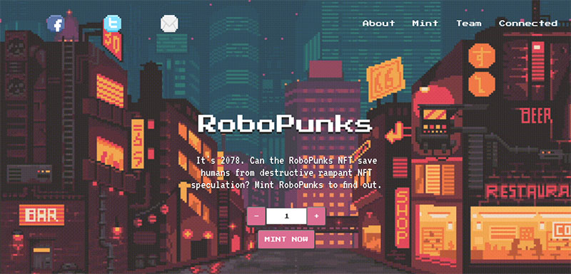

# MMR Web3 Mint Website



Full Web3 Mint Website for a RoboPunks NFT collection.

Includes the Smart Contract deployed on the Goerli test network and the Front End Mint Website.

### Prerequisites

The followings are required for this project:

1. Node.js installed on your machine
2. Metamask wallet extension installed as a browser extension

### The Stack

This is a full stack application using:

- **Web application framework** - [React](https://reactjs.org/)
- **Solidity development environment** - [Hardhat](https://hardhat.org/)
- **Ethereum RPC Provider** - [Infura](https://infura.io/)
- **UI component library** - [Chakra UI](https://chakra-ui.com/)
- **Ethereum Web Client Library** - [Ethers.js](https://docs.ethers.io/v5/)

## Running the Project

Hardhat configuration is set up for a deployment on the Goerli test network.

To deploy the smart contract, create a `.env` file at the root of the project using the template provided in the project. You will need to get:

- A RPC Endpoint URL from Infura (Goerli Network)
- A [Etherscan](https://etherscan.io/) API Key
- The Private Key from your Metamask deployer account

Then you can run the following commands to deploy on the Goerly test network:

```sh
npx hardhat clean
npx hardhat compile
npx hardhat run scripts/deployRoboPunksNFT.js --network goerly
```

When the deployment is complete, the CLI should print out the addresses of the contracts that were deployed. You can verify the contract on Etherscan by running the following command, replacing the address of the deployed contract:

```sh
npx hardhat verify --network goerly <deployed-contract-address>
```

### Launching the application

```sh
npm run start
```
